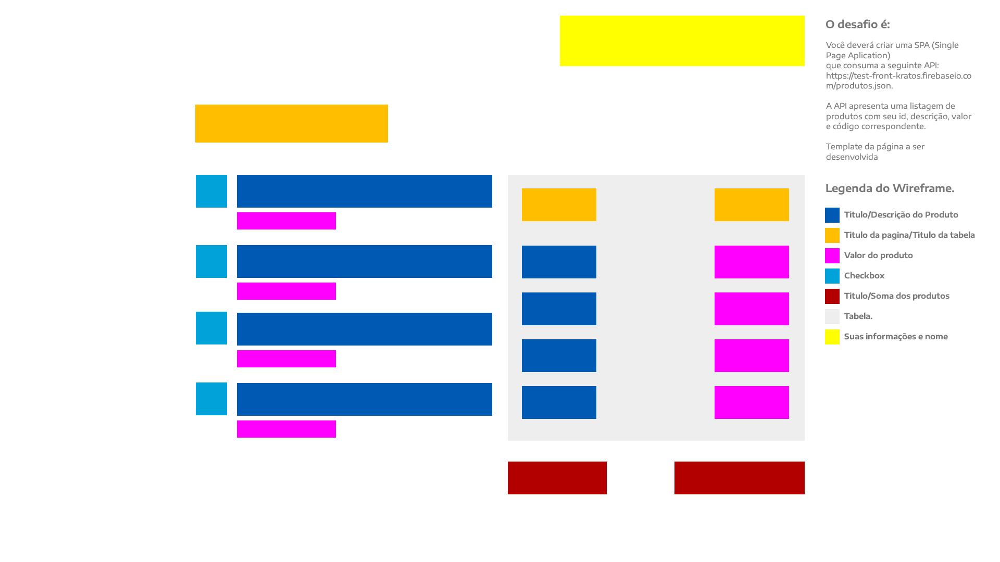

<h1 align="center">teste-estagio-front-end 👋</h1>

> Estamos procurando pessoas que queiram trabalhar bastante, aprender e crescer rápido junto com a nossa empresa. Acreditamos na importância do primeiro contato com o mercado de trabalho.

## Requisitos

* Cursando superior em áreas relacionadas a TI (Análise de Sistemas, Engenharia da Computação, Sistemas de Informação e afins)

* Conhecer (mesmo que superficialmente) as seguintes tecnologias:
  * HTML
  * CSS
  * Javascript
  * Git
  * Bootstrap
  * jQuery

## Conhecimento desejável

* PHP / Framework Laravel vs 8

* React JS

* Vue JS

## Tecnologias/Padrões para o desafio

 * HTML
 * CSS
 * Bootstrap
 * React ou Vue JS

 **Observações:**

* Não entende/conhece de algumas das tecnologias descritas acima? Não tem problema. Você pode submeter o seu projeto em qualquer tecnologia. Porém projetos que utilizem as tecnologias acima terão pontuações maiores.

* Não conseguiu finalizar completamente o projeto? Também não tem problema, consideraremos cada linha de código escrita.

## Quais são as etapas para participar do processo?

* Implemente o desafio proposto no abaixo.

* Faça um push para seu repositório com o desafio implementado (Deixar publico).

* Crie um Readme de como rodar o projeto.

* Envie um email para (luisfgsales@gmail.com) e (dvaldodev@gmail.com) com a URL do seu repositorio avisando que você concluiu o projeto.

## 🤝 O Desafio:

Você deverá criar uma SPA (Single Page Aplication) que consuma a seguinte API: https://edvaldotorres.com.br. A API apresenta uma listagem de produtos com seu id, descrição, valor e código correspondente. A imagem abaixo mostra como deverá ser o layout implementado. Do lado esquerdo é apresentada uma listagem de produtos(que é obtida pela API). No lado direito deverá apresentar uma lista, que consiste na lista de produtos selecionados do lado esquerdo e ao final um totalizador contendo a somatória dos produtos selecionados.

## Critérios de avaliação:

* Usabilidade.

* Criatividade.

* Organização do código.

* Performance do código.

* Documentação do código.

* Boas práticas de desenvolvimento.

* Arquitetura do projeto.

* Documentação do projeto (README)

## Restou alguma dúvida?

Você pode enviar um email para: (luisfgsales@gmail.com) ou (dvaldodev@gmail.com) !!! e Boa Sorte ⭐️
